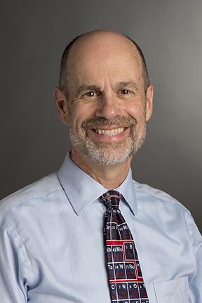

**Paul Craig** is a computational biochemist who teaches general chemistry for engineers and is the Director of the BASIL project. In addition to BASIL, he works on [Python Scripting for Biochemistry & Molecular Biology](http://education.molssi.org/python-scripting-biochemistry/chapters/setup.html), [simulations of chemical separations](https://github.com/RITJBF/JBioFramework) and virtual reality. 

**Ashley Ringer McDonald** is an associate professor of chemistry at Cal Poly San Luis Obispo.  She is the BASIL team's resident computational chemist and the digital resources manager.  Ashley also serves as the Co-Director for Education, Training, and Faculty development on the Board of Directors of the [Molecular Sciences Software Institute](https://molssi.org). 
