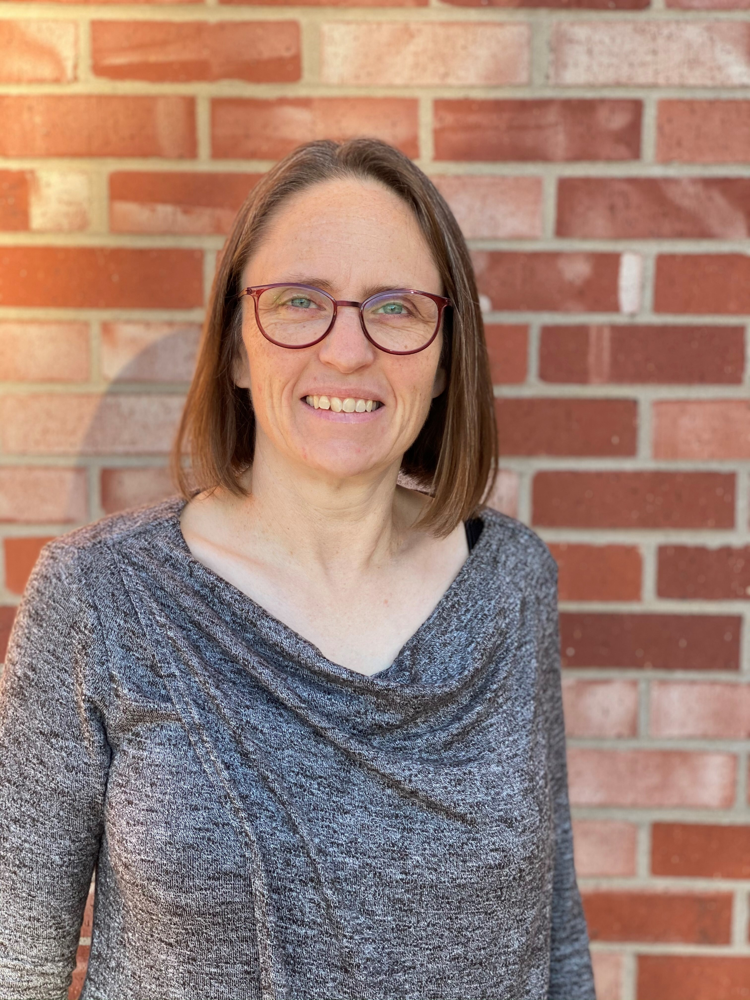

**Paul Craig** is a computational biochemist who teaches general chemistry for engineers and is the Director of the BASIL project. In addition to BASIL, he works on [Python Scripting for Biochemistry & Molecular Biology](http://education.molssi.org/python-scripting-biochemistry/chapters/setup.html), [simulations of chemical separations](https://github.com/RITJBF/JBioFramework) and virtual reality.                

**Jon Dattelbaum** is a biochemist at University of Richmond. In addition to incorporating BASIL modules into lab and lecture classes, his research focuses on the biophysical characterization of thermophilic proteins and fluorescent protein biosensors.               

**Bonnie Hall** is a biochemist who teaches introductory and upper division biochemistry courses for science majors. She uses BASIL in her biochemistry laboratory course. She also has a growing interest in machine learning and predictive modeling.               

**Mike Pikaart** is a biochemist at Hope College in Michigan.  He teaches general and introductory chemistry in addition to biochemistry.  With a research background in chromatin structure and gene regulation, and more recently does research with his undergraduate students on the microbiology and chemistry of recreational and drinking water.           

**Julia Koeppe** is an associate professor of chemistry at SUNY Oswego. She uses BASIL in biochemistry laboratory courses for both majors and nonmajors as well as for independent student research projects.           

**Krystle J. McLaughlin** is an assistant professor in the Chemistry Department at Vassar College. She teaches biophysical chemistry and biochemistry. Her research makes primary use of macromolecular x-ray crystallography to investigate protein structure and function, focusing on proteins essential to antibiotic resistance in Staphylococcus & Salmonella. In addition to using BASIL modules, she is interested in bringing macromolecular x-ray crystallography into CUREs.            

**Steve Mills** is a biochemist in the Chemistry Department at Xavier University. He teaches Biochemistry and Organic Chemistry. He uses BASIL in his Biochemistry Lab course. His research background is in using enzyme kinetics to determine enzyme mechanisms.              

**Erika Offerdahl** is a Professor of biochemistry and education researcher at Washington State University. Her research focuses broadly on the mechanisms by which scientific expertise is developed in undergraduates.  Current projects include  (1) students’ visualization skills in biochemistry and molecular biology, (2) the role of classroom assessment in supporting the development of scientific expertise, and (3) deliberative argumentation as a vehicle for learning in undergraduate biology.             

**Ashley Ringer McDonald** is an associate professor of chemistry at Cal Poly San Luis Obispo.  She is the BASIL team's resident computational chemist and the digital resources manager.  Ashley also serves as the Co-Director for Education, Training, and Faculty development on the Board of Directors of the [Molecular Sciences Software Institute](https://molssi.org).    

**Rebecca Roberts** is a Biology Professor at Ursinus College. She uses BASIL to model interdisciplinary research as part of a cross-course experience for students enrolled in upper-level Biochemistry and Structural Biology courses. She is passionate about improving biomolecular literacy of students.
